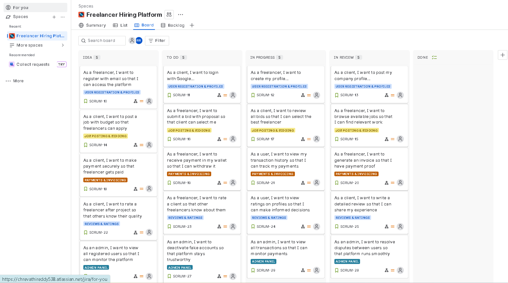
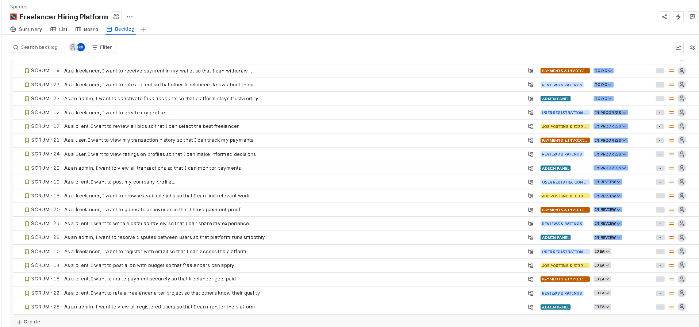
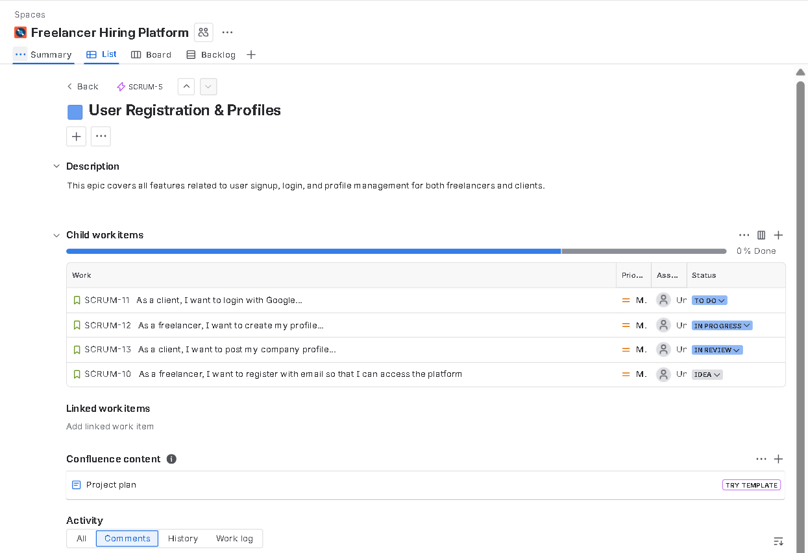
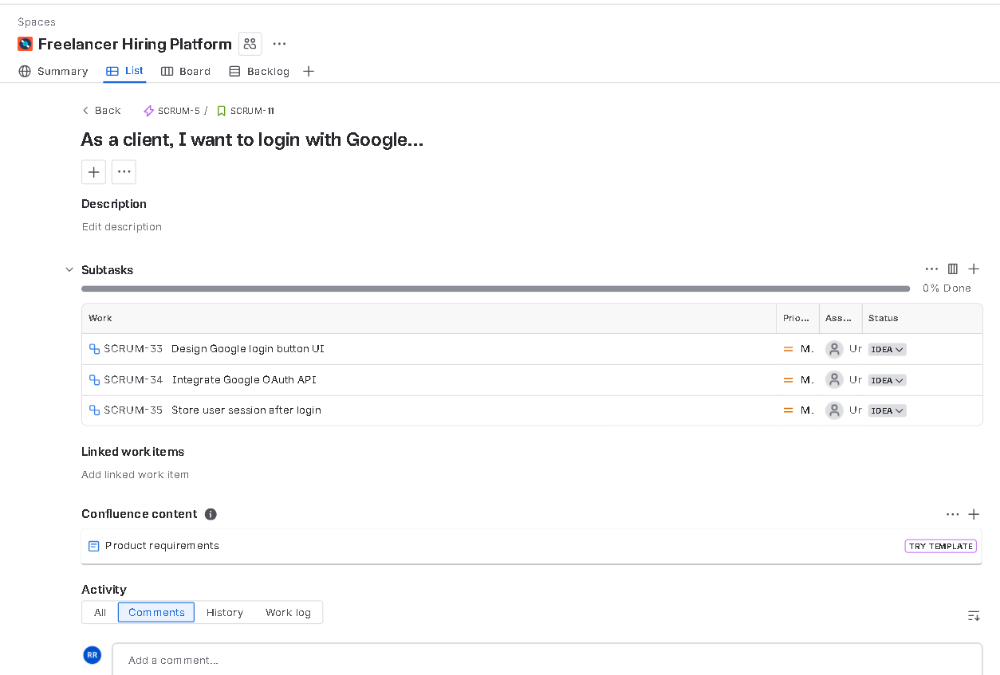
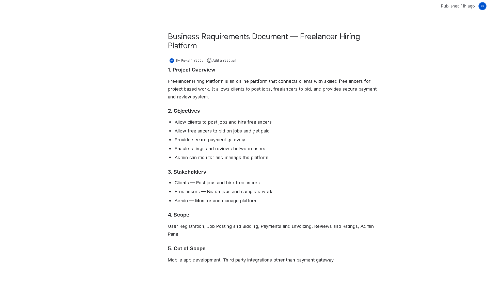
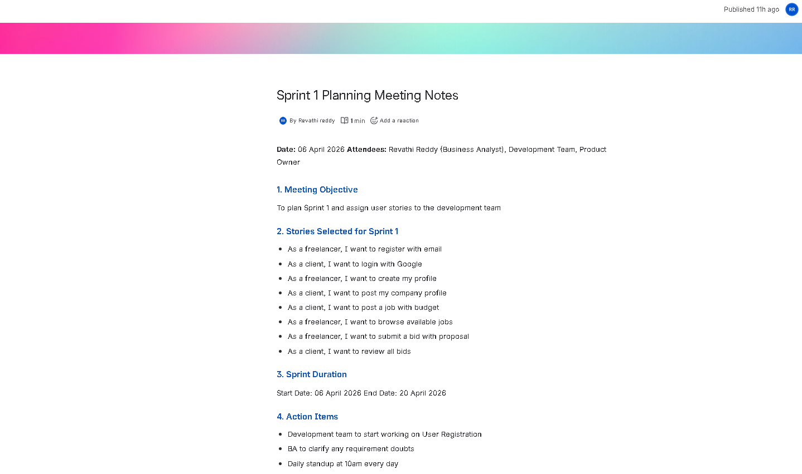
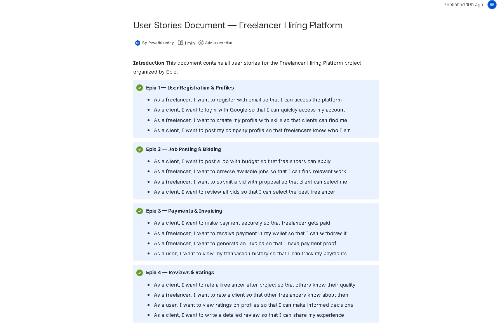

# Freelancer Hiring Platform — BA Project

## Project Overview
A Business Analyst portfolio project built using 
Jira and Confluence demonstrating end to end 
project management and documentation skills.

## Tools Used
- Jira — Project Management
- Confluence — Documentation
- Agile Scrum Methodology

## Project Structure
- 5 Epics
- 20 User Stories
- 60 Subtasks
- 1 Sprint

## Epics
1. User Registration & Profiles
2. Job Posting & Bidding
3. Payments & Invoicing
4. Reviews & Ratings
5. Admin Panel

## Confluence Documents
- Business Requirements Document (BRD)
- Sprint Planning Meeting Notes
- User Stories Document

## Screenshots

### Jira Board

### Backlog

### Epic View

### Story with Subtasks

### BRD Document

### Sprint Planning Meeting Notes

### User Stories Document

